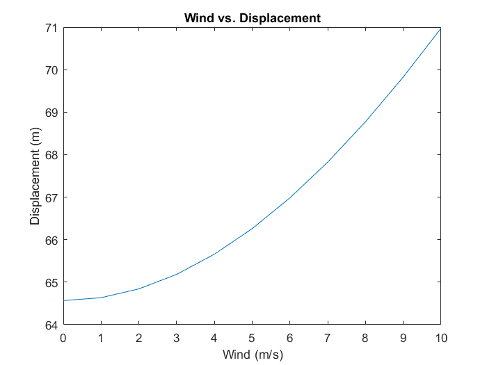

# Aircraft-Dynamics-1

## Purpose:
To represent the kinematics of a golfball and balloon using first order differential equations so that we can numerically compute the states of each with respect to time using MATLAB's adaptive 4th/5th order Runge Kutta ordinary differential equations solver.

## Problem 9

The first task we to develop a simulation for a golf ball that could account for variations of wind. Using MATLAB to vary the wind from 0 to 10 meters a second in the North direction, the following trajectory was found:

  

The next task was to find the variation in landing location to the amount of wind in the  North direction. The landing location is characterized by the total horizontal displacement relative to the golf balls origin and was computed over the increments of wind from 0 to 10 meters a second. The plot of total horizontal distance achieved version wind speed was then plotted as such:

  

Lastly, we were tasked with finding the distance traveled by the golf ball if the ball was constrained by the total amount of kinetic energy and the mass were to be variable. It was found that the ball traveled further when the mass of the ball were lighter than if it were its original mass or heavier. The following plots display this behavior for the masses of 0.25, 0.5, and 0.75 kilograms:

  

## Problem 10:
For this problem we had to find the trajectory of a balloon in variable wind conditions, particularly a balloon filled with 1 $m^3$ of helium with wind prevailing at 4 $\frac{m}{s}$ north and 2 $\frac{m}{s}$ east. Plot for the balloons trajectory are as follows:

  

Lastly, we had to find the relationship between wind speed and required helium volume to maintain an accent angle of 45 degrees. This was found by iterating through varying volumes of at high resolution and taking the first point at which the angle of the balloon crosses 45$\degree$. This would need to be done for each unique wind condition.

